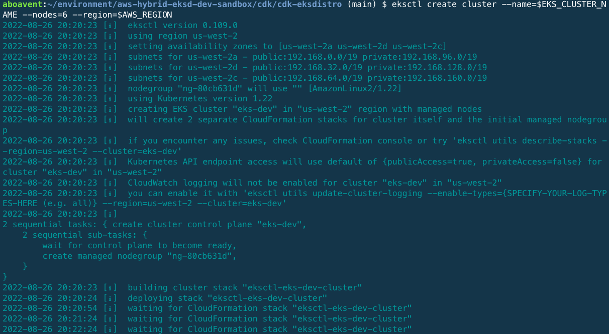
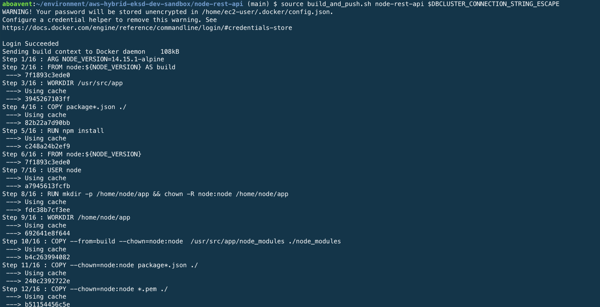
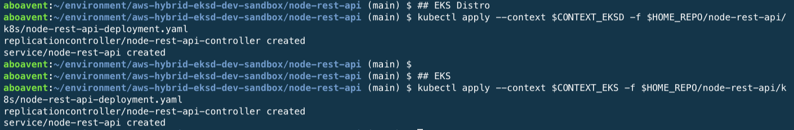
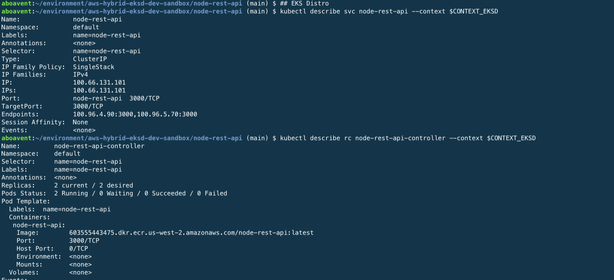

# Building a Hybrid Kubernetes environment with EKS Distro, EKS Anywhere, and EKS using the AWS CDK

We all know that Kubernetes enterprise-grade and large-scale implementations require dealing with hybrid and multi-cloud environments, often times with a different set of tooling and frameworks, and disparate environments with different APIs and services to build applications on-premises as in the cloud. As a result, customers need to spend time to rearchitect applications for different environments rather than build their applications just once to run anywhere, using the same wide range of popular services and APIs used in the cloud for those applications that need to run on-premises as well. 


## EKS Anywhere & EKS Distro coming to the rescue

**EKS Distro** is an installable set of the same open source Kubernetes components used by Amazon EKS, tested for interoperability, security, and scale, which includes the same components that form the Kubernetes control plane(e.g. API Server, CoreDNS, etcd, scheduler, etc) and data plane(kubelet, CNI, kubectl, etc) that is freely available when public Kubernetes releases occur. We all know there is a set of related components that work together to form the larger Kubernetes platform. Some of these components, like etcd, and CoreDNS, are actually separate open source projects and must be tested for interoperability and version compatibility. In other words, AWS puts together a lot of work to select the right Kubernetes version, validate dependencies to provide the security, stability, and operational excellence to reduce the complexity of Kubernetes operations that our customers need for a smoother experience and faster project implementations.

**EKS Anywhere** provides cluster lifecycle management tooling that enables customers to install, upgrade, and manage EKS Distro based-clusters at scale for on-premises environments. The goal is to provide a managed EKS-like experience regardless of where Kubernetes workloads are running. To accomplish this, EKS Anywhere provides an opinionated bundle of tooling to assist with differences in how on-premises environments are configured as compared to cloud, which allows customers to deploy, manage, and operate Kubernetes environments on their own bare metal or virtualized environments based on EKS Distro. 

In summary, the way to think about these 2 offerings is that EKS Distro gives customers kubernetes version consistency whereas EKS Anywhere gives them cluster operations lifecycle consistency with AWS. 

## Contributors

1. Andre Boaventura, AWS Principal Solutions Architect


## A 10,000-foot view of the EKS hybrid environment architecture


In this project, I will discuss and implement the following architecture consisting of 3 EKS clusters created with EKS Distro, EKS Anywhere, and EKS on AWS Cloud by leveraging the [AWS CDK](https://aws.amazon.com/cdk/) to automate infrastructure provisioning and configuration. Also, you will learn how to implement a hybrid EKS environment and monitor all of the clusters from a single pane of glass with EKS Console through the integration with [EKS Connector](https://docs.aws.amazon.com/eks/latest/userguide/eks-connector.html). Here are the sections to fully implement the architecture below:

1. [Getting our hands dirty with EKS Distro](#1-getting-our-hands-dirty-with-eks-distro)
2. [Taking EKS Anywhere for a spin](#2-taking-eks-anywhere-for-a-spin)
3. [Spinning up an EKS cluster on AWS Cloud](#3-spinning-up-an-eks-cluster-on-aws-cloud)
4. [Building and Deploying a REST API with Node.js, Express, and Amazon DocumentDB](#4-building-and-deploying-a-rest-api-with-nodejs-express-and-amazon-documentdb)
5. [Monitoring EKS Distro and EKS Anywhere by using EKS Connector](#5-monitoring-eks-distro-and-eks-anywhere-by-using-eks-connector-optional) **(Optional)**

#### Overall EKS hybrid environment architecture


---

## 1. Getting our hands dirty with EKS Distro

That’s enough theory. Time to roll up our sleeves and get going with EKS Distro! In this section, we will deploy the following architecture with EKS Distro.


### Prerequisites

 - An [AWS account](https://aws.amazon.com/premiumsupport/knowledge-center/create-and-activate-aws-account/) with IAM administrator-level credentials
 - A [GitHub account](https://help.github.com/en/github/getting-started-with-github/signing-up-for-a-new-github-account)
 - Create an [AWS Cloud9](https://aws.amazon.com/cloud9/) environment
 - An [AWS Route 53](https://docs.aws.amazon.com/Route53/latest/DeveloperGuide/domain-register.html) registered domain created in either the same or another AWS account running this example
 - [Kubernetes CLI](https://kubernetes.io/docs/reference/kubectl/kubectl/) (kubectl)
  

### Setup

In this section, I will explain how to deploy EKS Distro using the AWS CDK in the AWS Cloud9 workspace:

a. [Create and configure an AWS Cloud9 environment](#a-create-and-configure-an-aws-cloud9-environment)

b. [Clone the EKS Hybrid environment sample code repository and installing dependencies](#b-clone-the-eks-hybrid-environment-sample-code-repository-and-installing-dependencies)

c. [Getting to know the EKS Distro CDK app](#c-getting-to-know-the-eks-distro-cdk-app)

d. [Set up AWS CDK in the AWS Cloud9 workspace](#d-set-up-aws-cdk-in-the-aws-cloud9-workspace)

e. [Changing AWS CDK context parameters before deploying stacks](#e-changing-aws-cdk-app-parameters-before-deploying-stacks)

f. [Building and deploying the EKS Distro CDK app](#f-building-and-deploying-the-eks-distro-cdk-app)

g. [Accessing the EKS Distro environment](#g-accessing-the-eks-distro-environment)

h. [Validating Cluster DNS Configuration](#h-validating-cluster-dns-configuration-optional) (**OPTIONAL**)

i. [Validating Cluster Deployment](#i-validating-cluster-deployment-optional) (**OPTIONAL**)

j. [Scaling out your EKS Distro cluster](#j-scaling-out-your-eks-distro-cluster-optional) (**OPTIONAL**)


### a. Create and configure an AWS Cloud9 environment

Log in to the AWS Management Console and search for _*Cloud9*_ services in the search bar:


Click _**Cloud9**_ and create an AWS Cloud9 environment in any region of your preference. In this blog I’ll be using **`us-west-2`** as my preferred region


Launch the AWS Cloud9 IDE and open a new terminal session. Before getting started with installation, you will need to properly grant permissions to create the EKS Distro cluster with kops as required. There are some ways to provide credentials to the Cloud9 environment to proceed with cluster deployment such as [attaching an IAM instance profile](https://docs.aws.amazon.com/cloud9/latest/user-guide/credentials.html#credentials-temporary) to the EC2 instance or [creating/modifying an IAM user](https://kops.sigs.k8s.io/getting_started/aws/) with [permanent AWS access credentials](https://docs.aws.amazon.com/cloud9/latest/user-guide/credentials.html#credentials-permanent-create) which should be stored within the environment using either `aws configure` or environment variables(`AWS_ACCESS_KEY_ID` and `AWS_SECRET_ACCESS_KEY`). Detailed instructions on how to create an IAM role for Cloud9 workspace can also be found [here](https://www.eksworkshop.com/020_prerequisites/iamrole/) and how to attach it to the just created workspace [here](https://www.eksworkshop.com/020_prerequisites/ec2instance/). Additionally, you must turn off the AWS managed temporary credentials of the Cloud9 environment as explained [here](https://www.eksworkshop.com/020_prerequisites/workspaceiam/). You may also need to resize the Amazon Elastic Block Store (Amazon EBS) volume that is associated with the Amazon EC2 instance for this AWS Cloud9 environment, which is documented [here](https://docs.aws.amazon.com/cloud9/latest/user-guide/move-environment.html#move-environment-resize).

### b. Clone the EKS Hybrid environment sample code repository and installing dependencies

Let's get started by installing the dependencies to set up this environment. If needed, there are more details on how to configure `kubectl` [here](https://docs.aws.amazon.com/eks/latest/userguide/install-kubectl.html) 

```bash
## Installing kubectl (1.22)
curl -o kubectl https://s3.us-west-2.amazonaws.com/amazon-eks/1.22.6/2022-03-09/bin/linux/amd64/kubectl
chmod +x ./kubectl
mkdir -p $HOME/bin && cp ./kubectl $HOME/bin/kubectl 
export PATH=$PATH:$HOME/bin && echo 'export PATH=$PATH:$HOME/bin' >> ~/.bashrc

sudo yum install jq -y
export AWS_DEFAULT_REGION=$(curl -s 169.254.169.254/latest/dynamic/instance-identity/document | jq -r '.region')
```

Clone the GitHub repository containing the code sample for this example:

```bash
git clone https://github.com/aboavent/aws-eksd-eksa-hybrid.git 
```

### c. Getting to know the EKS Distro CDK app

This repository contains source code for an AWS CDK app consisting of 2 stacks(**`CdkRoute53Stack`** and **`CdkEksdistroStack`**, respectively), which are equivalent to AWS CloudFormation stacks, to automate EKS Distro deployment. They have been written in TypeScript and use AWS CDK to define the AWS infrastructure needed for stand up the EKS Distro cluster as needed. In turn, stacks contain constructs, each of which defining one or more concrete AWS resources, such as EC2 instances, IAM roles, S3 buckets, and so on. In this example, you may find below each stack, with their respective AWS resources, initialized by some of the AWS CDK constructs.

**Key AWS CDK constructs used in the CdkRoute53Stack** (`./cdk/cdk-eksdistro/lib/cdk-route53-stack.ts`)

<details>
  <summary>An AWS Route 53 parent domain and child domain </summary>

```typescript
if (crossAccountRoute53) {
        
        const IsParentAccount = this.node.tryGetContext('IsParentAccount');

        if (IsParentAccount) {
            const childAccountId = this.node.tryGetContext('childAccountId'); 

            
            // Parent hosted zone is created. Child hosted zone will be exported into this record
            const parentZone = new route53.PublicHostedZone(this, 'HostedZone', {
                  zoneName: zoneName, // 'aboavent.net'
                  crossAccountZoneDelegationPrincipal: new iam.AccountPrincipal(childAccountId),
                  crossAccountZoneDelegationRoleName: 'MyRoute53DelegationRole',
            }); 
             
        } else {
          
          // Child hosted zone is created
          const subZone = new route53.PublicHostedZone(this, 'SubZone', {
              zoneName: subZoneName // E.g.: 'eksd.aboavent.net'
          });
          
          // import the delegation role by constructing the roleArn
          const parentAccountId = this.node.tryGetContext('parentAccountId');

          const delegationRoleArn = Stack.of(this).formatArn({
            region: '', // IAM is global in each partition
            service: 'iam',
            account: parentAccountId, 
            resource: 'role',
            resourceName: 'MyRoute53DelegationRole',
          });
          const delegationRole = iam.Role.fromRoleArn(this, 'DelegationRole', delegationRoleArn);
          
          // Export the record under the parent Hosted Zone in a different AWS account
          new route53.CrossAccountZoneDelegationRecord(this, 'delegate', {
            delegatedZone: subZone,
            parentHostedZoneName: zoneName, // E.g.: 'aboavent.net' or you can use parentHostedZoneId
            delegationRole,
          });
          
        }
        
    } else {
              
        // Child hosted zone is created
        new route53.PublicHostedZone(this, 'SubZone', {
            zoneName: subZoneName // E.g.: 'eksd.aboavent.net'
        });
    
    }
```
</details>


**Key AWS CDK constructs used in the CdkEksDistroStack** (`./cdk/cdk-eksdistro/lib/cdk-eksdistro-stack.ts`)

<details>
  <summary>A key pair to be assigned to the EC2 instance for accessing it from the AWS Cloud9 terminal</summary>
 
```typescript
    const key = new KeyPair(this, 'KeyPair', {
       name: 'cdk-eksd-key-pair',
       description: 'Key Pair created with CDK Deployment',
    });
    key.grantReadOnPublicKey
```
</details>
 
 
<details>
  <summary>A security group to allow inbound connection via SSH (port 22)</summary>

```typescript
    const vpc = ec2.Vpc.fromLookup(this, 'DefaultVPC', { isDefault: true });
    
    const securityGroup = new ec2.SecurityGroup(this, 'SecurityGroup', {
      vpc,
      description: 'Allow SSH (TCP port 22) in',
      allowAllOutbound: true
    });
    securityGroup.addIngressRule(ec2.Peer.anyIpv4(), ec2.Port.tcp(22), 'Allow SSH Access')
```
</details>


<details>
  <summary>IAM role with the following required policies to install EKS-D with kops</summary>

```typescript
    const role = new iam.Role(this, 'ec2-EKSD-Role', {
      assumedBy: new iam.ServicePrincipal('ec2.amazonaws.com')
    })
    
    role.addManagedPolicy(iam.ManagedPolicy.fromAwsManagedPolicyName('AmazonSSMManagedInstanceCore'))
    role.addManagedPolicy(iam.ManagedPolicy.fromAwsManagedPolicyName('AmazonEC2FullAccess'))
    role.addManagedPolicy(iam.ManagedPolicy.fromAwsManagedPolicyName('AmazonRoute53FullAccess'))
    role.addManagedPolicy(iam.ManagedPolicy.fromAwsManagedPolicyName('AmazonS3FullAccess'))
    role.addManagedPolicy(iam.ManagedPolicy.fromAwsManagedPolicyName('IAMFullAccess'))
    role.addManagedPolicy(iam.ManagedPolicy.fromAwsManagedPolicyName('AmazonVPCFullAccess'))
    role.addManagedPolicy(iam.ManagedPolicy.fromAwsManagedPolicyName('AmazonSQSFullAccess'))
    role.addManagedPolicy(iam.ManagedPolicy.fromAwsManagedPolicyName('AmazonEventBridgeFullAccess'))
```
</details>
 

<details>
  <summary>An EC2 instance using the default VPC with the required dependencies to install EKS Distro through kops. It uses the CloudFormation init `cfn-init` helper script as a way to execute init scripts once the EC2 instance boots to install packages. </summary>

```typescript
    const ami = new ec2.AmazonLinuxImage({
      generation: ec2.AmazonLinuxGeneration.AMAZON_LINUX_2,
      cpuType: ec2.AmazonLinuxCpuType.X86_64
    });
    

    // Create the instance using the Security Group, AMI, library dependencies
    // and KeyPair based on the default VPC
    const ec2Instance = new ec2.Instance(this, 'Instance', {
      vpc,
      instanceType: ec2.InstanceType.of(ec2.InstanceClass.T3, ec2.InstanceSize.LARGE),
      machineImage: ami,
      init: ec2.CloudFormationInit.fromElements(
          ec2.InitCommand.shellCommand('sudo yum update -y'),
          ec2.InitCommand.shellCommand('sudo yum install git -y'),
          ec2.InitCommand.shellCommand('sudo yum install jq -y')
      ),
      blockDevices: [
          {
            deviceName: '/dev/xvda',
            volume: ec2.BlockDeviceVolume.ebs(50),
          }
      ],     
      securityGroup: securityGroup,
      keyName: key.keyPairName,
      role: role
    }); 
```
</details>

<details>
  <summary>Create an asset that will be used as part of User Data to run on first load</summary>

```typescript
    const asset = new Asset(this, 'Asset', { path: path.join(__dirname, '../src/config.sh') });
    const localPath = ec2Instance.userData.addS3DownloadCommand({
      bucket: asset.bucket,
      bucketKey: asset.s3ObjectKey,
    });

    ec2Instance.userData.addExecuteFileCommand({
      filePath: localPath,
      arguments: '--verbose -y'
    });
    asset.grantRead(ec2Instance.role);
```
</details>

 
**CdkEksDistro CDK app** (`./cdk/cdk-eksdistro/lib/cdk-eksdistro.ts`)

This is the entrypoint of the EKS Distro CDK application. It will load the 2 stacks defined in `./cdk/cdk-eksdistro/lib/cdk-eksdistro-stack.ts` and `./cdk/cdk-eksdistro/lib/cdk-route53-stack.ts`. Please note that as we have stack dependency, since the EKS Distro may only be provisioned when a registered AWS Route 53 domain is configured, I added an ordering dependency between two stacks by using the `stackA.addDependency(stackB)` method to make sure the stack **CdkEksDistroStack** will only run after a successful completion of the **CdkRoute53Stack** stack.

Additionally, you can use either `CDK_DEFAULT_ACCOUNT` and `CDK_DEFAULT_REGION` or `CDK_DEPLOY_ACCOUNT` and `CDK_DEPLOY_REGION` to set the AWS region and AWS account where the 2 stacks will be deployed. The former is determined by the AWS CDK CLI at the time of synthesis, whereas the latter uses environment variables to let you override the account and region at synthesis time.

```typescript
   const app = new cdk.App();

   // Route53 Stack - requirement for running the EKS Distro stack
   const stackRoute53 = new CdkRoute53Stack(app, 'CdkRoute53Stack');

   // EKS Distro Stack
   const stackEKSD = new CdkEksDistroStack(app, 'CdkEksDistroStack', { 
     env: { 
       account: process.env.CDK_DEPLOY_ACCOUNT || process.env.CDK_DEFAULT_ACCOUNT, 
       region: process.env.CDK_DEPLOY_REGION || process.env.CDK_DEFAULT_REGION 
   }});
   stackEKSD.addDependency(stackRoute53);
```


### d. Set up AWS CDK in the AWS Cloud9 workspace

First off, ensure AWS CDK is installed and [bootstrapped](https://docs.aws.amazon.com/cdk/latest/guide/bootstrapping.html). The CDK uses the same supporting infrastructure for all projects within a region, so you only need to run the bootstrap command once in any region in which you create CDK stacks. In this example, let us use `us-west-2` as the preferred region. Also, `npm install` will install all the latest CDK modules under the node_modules directory according to the definitions and dependencies declared in the `package.json` file. 

```bash
cd ~/environment/aws-eksd-eksa-hybrid/cdk/cdk-eksdistro
npm install
cdk bootstrap
```

### e. Changing AWS CDK app parameters before deploying stacks

#### User Data (REQUIRED)

The `/src/config.sh` file is used as [user-data](https://docs.aws.amazon.com/AWSEC2/latest/UserGuide/user-data.html) by the EC2 instance spun up by the **`CdkEksDistroStack`** to do the following tasks:
- install dependencies(`e.g., git, jq, kubectl, kops`)
- add environment variables required by kops to the shell initialization file `~/.bashrc`
- clone the [EKS Distro repository](https://github.com/aws/eks-distro.git)
- create the cluster configuration
- wait for the cluster to come up until deployment is finished 

This script is located in your AWS Cloud9 environment at `~/environment/aws-eksd-eksa-hybrid/cdk/cdk-eksdistro/src/config.sh`.

You should change the following environment variables to point to your environment configuration accordingly before deploying the CDK app. 

> All these changes are **REQUIRED**:


- `KOPS_CLUSTER_NAME` is a valid subdomain controlled by AWS Route 53. 
- `KOPS_STATE_STORE` is the URL for the s3 bucket which will store kops configuration.
- `IAM_ARN` is either an IAM user or role to view Kubernetes resources in Amazon EKS console, which in turn, will be associated with a Kubernetes role or clusterrole with necessary permissions to read EKS Distro resource. More information on granting access to a user to view Kubernetes resources on a cluster are available [here](https://docs.aws.amazon.com/eks/latest/userguide/connector-grant-access.html)

#### Environment variables changes (OPTIONAL)


- `RELEASE_BRANCH` is the Kubernetes distribution used by EKS-D 
- `RELEASE` is the EKS-D release
- `EKSCONNECTOR_CLUSTER_NAME` is the name used to register the EKS-D cluster with the EKS Console by using the EKS Connector.

More details on EKS-D releases can be found [here](https://distro.eks.amazonaws.com/#releases). 


#### AWS CDK context values (REQUIRED)

[Context values](https://docs.aws.amazon.com/cdk/v2/guide/context.html) are key-value pairs that can be associated with an AWS CDK app, stack, or construct, and they can be provided in different ways.

In this example, there are some key-values used to control the way application will deploy the AWS Route 53 parent and subdomain depending whether or not a multi AWS account setup will be utilized to deploy the EKS Distro cluster through kOps. This AWS CDK configuration file is located in your AWS Cloud9 environment at `~/environment/aws-eksd-eksa-hybrid/cdk/cdk-eksdistro/cdk.context.json`

That said, you may indicate whether or not you will be deploying a parent hosted zone in a different account than the child hosted zone. If so, set `"crossAccountRoute53": true` and run AWS CDK app described in the section below twice: 
 1) At first, on the parent account by changing the `"IsParentAccount": true`

 2) Then, on the child account by changing the `"IsParentAccount": false`

Also, remember to properly setup `parentAccountId` and `childAccountId` as needed. 

Otherwise, in case you will be setting up everything under the same AWS account(**the most common scenario**), you'll basically need to run the AWS CDK app once, and set `"crossAccountRoute53": false`, which means `parentAccountId` and `childAccountId` won't be used.

> Regardless the approach you'll be using for deploying the AWS Route 53 domains, remember to set both `zoneName` and `subZoneName`. 

> `subZoneName` should be set with the same domain as defined in the environment variable `KOPS_CLUSTER_NAME` at the user-data script `/src/config.sh` file, as detailed in the [previous section](#user-data-required).

```bash
{
  "crossAccountRoute53": true,
  "IsParentAccount": false,
  "parentAccountId": "111222333444", 
  "childAccountId": "555666777888",  
  "zoneName": "aboavent.net",        
  "subZoneName": "eksd.aboavent.net" 
}
```

### f. Building and deploying the EKS Distro CDK app

Deploying the EKS Distro CDK app is a straightforward task. You basically need to execute `npm run build` to compile typescript to js, and, then, execute `cdk deploy --all` to deploy both stacks to the configured AWS account and region, which may take about **`5-6 minutes`** to complete. 

```bash
npm run build
cdk deploy --all
```

> Type __Y__ to confirm both stacks deployment


The syntax and additional details of AWS CDK commands are documented [here](https://docs.aws.amazon.com/cdk/latest/guide/cli.html#cli-commands)


### g. Accessing the EKS Distro environment

#### Output

- `CdkEksDistroStack.DownloadKeyCommand`: The command needed to download the private key that was created.
- `CdkEksDistroStack.EC2PublicIPaddress`: The EC2 public IP address
- `CdkEksDistroStack.EKSDistrokubeconfigscpcommand`: The command used to copy EKS Distro kubeconfig file to the AWS Cloud9 environment to be able connect to the cluster using kubectl from the AWS Cloud9 instance.
- `CdkEksDistroStack.sshcommand`: The command used to connect to the instance.


#### Keys and Access

A Key Pair is created as part of this project. The public key will be installed as an authorized key in the EC2 instance. To connect to the instance:

1. Download the private key from aws secretsmanager:

    ```bash
    # This will download the key as `cdk-eksd-key-pair.pem` and grant permissions.
    aws secretsmanager get-secret-value --secret-id ec2-ssh-key/cdk-eksd-key-pair/private --query SecretString --output text > cdk-eksd-key-pair.pem && chmod 400 cdk-eksd-key-pair.pem
    ```

2. SSH to the instance using the command provided from the stack's output `CdkEksDistroStack.sshcommand`.

    For example:

    ```bash
    ssh -i cdk-eksd-key-pair.pem -o IdentitiesOnly=yes ec2-user@X.X.X.X
    ```

    _Find the command for your specific instance in the stack's output._


Upon connection to the EC2 instance, you can check the cloud-init output log file `/var/log/cloud-init-output.log` as it captures console output which allows to easily monitor and/or debug the automated script `/src/config.sh` while launching the EKS Distro cluster by using kOps. You may run the following command to monitor the EC2 instance initialization, and, thus, all details of EKS Distro cluster provisioning if needed:

```bash
    sudo tail -f /var/log/cloud-init-output.log
```


> **Note:** If you come across any glitches while deploying the EKS Distro with a message similar to **Error: error building complete spec: error reading tag file**, it's likely that the EKS Distro chosen is unavailable or hasnt' passed the building process. As such, make sure you're using the lastest distribution as per instructions in EKS Distro [github repo](https://github.com/aws/eks-distro). If needed, change both **RELEASE_BRANCH** and **RELEASE** ([as per instructions above](#environment-variables-changes-optional)) to point to the desired EKS distribution and redeploy the **CdkEksDistro CDK app**.

### h. Validating Cluster DNS Configuration (OPTIONAL)

This example leveraged [kOps](https://kops.sigs.k8s.io/getting_started/aws/) for provisioning the required cloud infrastructure to successfully deploy the EKS Distro clustered environment. You can think of kops (aka Kubernetes Operations) as the `Kubernetes CLI (kubectl)` for clusters, allowing Kubernetes administrators to create, destroy, upgrade, and maintain production-grade and highly available clusters

kops uses DNS for discovery, both inside and outside the cluster, so that you can reach the kubernetes API server from clients. A top-level domain or a subdomain is required to create the cluster. This domain allows the worker nodes to discover the master, and the master to discover all the etcd servers. Also, this is needed for kubectl to be able to connect directly with the master node. This example used both `zoneName` and `subZoneName` context parameters of the **CdkRoute53Stack** app to set up AWS Route 53 as detailed in the previous section [AWS CDK context values](#aws-cdk-context-values-required). 


All traffic sent to **`subZoneName`** will be routed to the correct subdomain hosted zone in AWS Route 53. You can check your DNS configuration as follows:

```bash
dig ns $KOPS_CLUSTER_NAME

;; ANSWER SECTION:
eksd.aboavent.net.    300    IN    NS    ns-1041.awsdns-02.org.
eksd.aboavent.net.    300    IN    NS    ns-2025.awsdns-61.co.uk.
eksd.aboavent.net.    300    IN    NS    ns-177.awsdns-22.com.
eksd.aboavent.net.    300    IN    NS    ns-852.awsdns-42.net.
```

Alternatively, you can run the following command to check your NS records: 

```bash
aws route53 list-resource-record-sets \
--output=table \
--hosted-zone-id `aws route53 --output=json list-hosted-zones | jq -r --arg SUBZONENAME "$KOPS_CLUSTER_NAME." '.HostedZones[] | select(.Name==$SUBZONENAME) | .Id' | cut -d/ -f3|cut -d\" -f1`
```

More details on how to [Configure DNS for kops](https://kops.sigs.k8s.io/getting_started/aws/#configure-dns) can be helpful in case you need to troubleshoot your installation.

### i. Validating cluster deployment (OPTIONAL)

EKS Distro installation comes with kops binaries and some scripts to streamline the deployment process. In turn, `kOps` is used to create and manage kubernetes clusters, including EKS Distro clusters, with multiple master and worker nodes distributed across multiple AZs for high availability purposes. Behind the scenes, it spins up EC2 instances, sets up security with IAM user and IAM roles and networking including VPC, subnets, routing tables, Route 53 NS records, security groups, and auto scaling groups, among other AWS resources to properly deploy EKS Distro on top of a highly scalable infrastructure as needed.

The automation script, `/src/config.sh`, has exported `KOPS_STATE_STORE` to the s3 bucket for EKS-D kops configuration. This S3 bucket was used to store both the state and representation of the EKS-D cluster. When kops state store does not exist, the cluster configuration script creates one for you. _You must have set `KOPS_CLUSTER_NAME` to the same valid subdomain controlled by AWS Route 53 configured in the previous section while setting up the **subZoneName** parameter in the `./cdk/cdk-eksdistro/cdk.context.json` file._

As such, you may find that this script runs `./run_cluster.sh` to both create the configuration and required cloud resources for the EKS Distro Cluster:

Here is a sample output for **REFERENCE ONLY** as this has already been automated for you:


#### Wait for the EKS-D cluster to come up

It may take a while (**`typically 15 min`**) for the cluster to be up and running, but you can check your cluster with the following command until it gets ready for usage:

```bash
cd ~/eks-distro/development/kops 
./cluster_wait.sh
```

Upon completion, you may confirm whether the pods in your cluster are using the EKS Distro images by running the following command:

```bash
kubectl --context $KOPS_CLUSTER_NAME get pod --all-namespaces -o json | jq -r '.items[].spec.containers[].image' | sort -u
```


By default, you could realize that this configuration stands up a **`1-master`** and **`3-worker nodes`** kubernetes cluster with high availability provided by a kops configuration called instance groups, which is a set of instances representing a group of similar machines typically provisioned in the same availability zone and purposely grouped together(e.g. control-plane-us-west-2a=master node and nodes=worker nodes as shown in the figure below). 

On AWS, instance groups are implemented via Automatic Scaling Groups(ASG), allowing administrators to configure several instances groups, for example splitting worker nodes and master nodes, defining a mix of spot and on-demand instances, or GPU and non-GPU instances as needed. Thus, each instance in the cluster will be automatically monitored and rebuilt by AWS if it suffers any failure. The default configuration has one ASG for master nodes and another one for worker nodes, with 1 and 3 nodes, respectively. However, you’ll learn how to adjust these configurations to scale out your EKS Distro cluster wit kops in the next steps in this section.


Note that kops just created a DNS record for the kubernetes API: **_api.eksd.aboavent.net_**. You can check this record with the following **_dig_** command.

```bash
dig +short api.$KOPS_CLUSTER_NAME A

Output
172.20.52.71
```

or through the AWS Console as follows


In the example above, the output is the public IP assigned to the master node. Alternatively, we can send a command to our master node via ssh which will output the same IP address as on the picture above, indicating that the Route 53 DNS resource record and the master node are working as expected:

```bash
ssh -i ~/.ssh/id_rsa ubuntu@api.$KOPS_CLUSTER_NAME "ec2metadata --public-ipv4"

Output
34.211.229.39
```

### j. Scaling out your EKS Distro cluster (OPTIONAL)

Let’s say workload has significantly increased and our cluster needs 3 additional worker nodes to serve more requests. We can do that by changing the instance group (mapped as an ASG) as explained above. First, let’s pull the instance group names from our cluster:

```bash
kops get instancegroups

NAME                            ROLE    MACHINETYPE     MIN     MAX     ZONES
control-plane-us-west-2a        Master  t3.medium       1       1       us-west-2a
nodes                           Node    t3.medium       3       3       us-west-2a,us-west-2b,us-west-2c
```

Then, let’s edit the instance group with the following command: 

```bash
kops edit ig nodes
```


As you can see in the configuration above, you can change parameters like IAM role, availability zone, machine type, etc. As our goal is to scale out, change both **`minSize and maxSize to 6`** and save the new configuration, as this represents the number of worker nodes in our kubernetes clusters after updating configuration. 

High availability is implemented by AWS auto scaling group to ensure cluster will scale out as needed. The Auto Scaling group “node” starts by launching enough instances to meet its desired capacity as per instance group configuration and maintains this number of instances by performing periodic health checks on the instances in the group. Also, it continues to maintain a fixed number of instances even if an instance becomes unhealthy. If an instance becomes unhealthy, the group terminates the unhealthy instance and launches another instance to replace it. 

```bash
kops update cluster --name $KOPS_CLUSTER_NAME
```


After reviewing the new instance group configuration, run the same command again, but this time specifying --yes to apply the changes into the environment:

```bash
kops update cluster --name $KOPS_CLUSTER_NAME --yes
```


Alternatively, we could also change ASG via AWS CLI or even the AWS Console. See below how to do it with AWS CLI. 

```bash
aws autoscaling update-auto-scaling-group \
    --auto-scaling-group-name nodes.${KOPS_CLUSTER_NAME} \
    --min-size 6 \
    --max-size 6 \
    --desired-capacity 6
```
**Note**: _The downside of this approach is that your cluster configuration won’t be in-sync with the AWS ASG configuration regarding the number of worker nodes._

While the changes are applied so that the new nodes can join the cluster, it’s time to do something else for about 5 minutes. If you run **`kops validate cluster`**, you will get the following status message:

```bash
VALIDATION ERRORS
KIND    NAME                    MESSAGE
Machine i-05f2f99e639e89b7a     machine "i-05f2f99e639e89b7a" has not yet joined cluster
Machine i-0c69b4620646b4a8b     machine "i-0c69b4620646b4a8b" has not yet joined cluster
Machine i-0e169d852e022cc34     machine "i-0e169d852e022cc34" has not yet joined cluster
```

After a while, you can check your cluster again to make sure all worker nodes has joined the cluster as expected. You can use either `kops validate cluster` on your terminal


or the `AWS Console` as shown below:


As you can see above, our EKS Distro cluster has scaled up to 6 worker nodes and it is up and running so that we can deploy applications.  

Finally, let's copy the just created EKS kubeconfig file into AWS Cloud9 environment to be able to use `kubectl` on the AWS Clou9 environment when needed on the next steps. As such, **you may exit the ssh session** established with the EC2 instance managing the EKS Distro cluster, and execute the commands below on the AWS Cloud9 terminal instead.

**Note:** 

> _Remember to use the value from the `CdkEksDistroStack.kubeconfigscpcommand` key before copying the EKS-D kubeconfig file by using scp_. 


```bash
# EKS Distro kubeconfig setup
mkdir $HOME/.kube
scp -i cdk-eksd-key-pair.pem ec2-user@X.X.X.X:$HOME/.kube/config $HOME/.kube/config
export CONTEXT_EKSD=$(kubectl config view -o jsonpath='{.contexts[0].name}')
mv $HOME/.kube/config $HOME/.kube/eksd.kubeconfig
```

Great job!! If you made it at this point, your EKS Distro cluster is all set. Next, let’s set up an EKS Anywhere cluster within our hybrid EKS environment.

---

## 2. Taking EKS Anywhere for a spin

As already mentioned earlier, EKS Anywhere allows customers to create and operate their Kubernetes clusters on-premises using tooling as their EKS managed clusters on AWS cloud, reducing complexity and cost. It can create and manage Kubernetes clusters on multiple providers. It uses EKS-D (EKS Distro) for bootstrapping the Kubernetes cluster. Each EKS Anywhere cluster is built from a cluster specification file, with the structure of the configuration file based on the target provider for the cluster.  

In this section, you’ll learn how to easily create an EKS Anywhere cluster by leveraging AWS CDK that will stand up a cluster for development purposes using the docker provider. The following architecture will be deployed: 


### Setup

- a. [Getting to know the EKS Anywhere CDK app](#a-getting-to-know-the-eks-anywhere-cdk-app)
- b. [Building and deploying the EKS Anywhere CDK app](#b-building-and-deploying-the-eks-anywhere-cdk-app)
- c. [EKS Anywhere under the hoods](#c-eks-anywhere-under-the-hoods)
    - [1-Accessing the EKS Anywhere EC2 instance](#c1---accessing-the-eks-anywhere-ec2-instance)
    - [2-Understanding the Bootstrap Cluster](#c2---understanding-the-bootstrap-cluster-optional) **(OPTIONAL)**
    - [3-Understanding the Workload Cluster](#c3---understanding-the-workload-cluster-optional) **(OPTIONAL)**
- d. [Scaling out the EKS Anywhere cluster](#d-scaling-out-the-eks-anywhere-cluster-optional) **(OPTIONAL)**


### a. Getting to know the EKS Anywhere CDK app

In the previous section, while setting up the EKS Distro cluster, we used the `/src/config.sh` file as [user-data](https://docs.aws.amazon.com/AWSEC2/latest/UserGuide/user-data.html) to install dependencies, add environment variables, etc. Again, we'll be using the same approach for the EKS-A cluster installation, but this time, this script will install the following tools and dependencies that must be in place to complete the EKS Anywhere setup accordingly as per [documentation](https://anywhere.eks.amazonaws.com/docs/getting-started/install/).

 - [Kubernetes CLI](https://kubernetes.io/docs/reference/kubectl/kubectl/) (kubectl)
 - [docker](https://docs.docker.com/get-docker/)
 - [eksctl](https://docs.aws.amazon.com/eks/latest/userguide/getting-started-eksctl.html) 
 - [eksctl anywhere](https://eksctl.io/usage/eksctl-anywhere/) plugin

This repository contains CDK source code with 1 stack(**`CdkEksAnywhereStack`**) to automate EKS Anywhere deployment. Under the `./cdk/cdk-eksanywhere/lib` folder, open the `cdk-eksanywhere-stack.ts` file and let us explore the following different CDK constructs.

**CdkEksAnywhereStack**

<details>
  <summary>A key pair to be assigned to the EC2 instance for accessing from AWS Cloud9 environment</summary>

```typescript
    const key = new KeyPair(this, 'KeyPair', {
       name: 'cdk-eksa-key-pair',
       description: 'Key Pair created with CDK Deployment',
    });
    key.grantReadOnPublicKey
```
</details>

<details>
  <summary>A security group to allow inbound connection via SSH (port 22) and kubectl</summary>

```typescript
    const vpc = ec2.Vpc.fromLookup(this, 'DefaultVPC', { isDefault: true });

    const securityGroup = new ec2.SecurityGroup(this, 'SecurityGroup', {
      vpc,
      description: 'Allow SSH (TCP port 22) in and kubectl connection to the EKS Anywhere cluster',
      allowAllOutbound: true
    });
    securityGroup.addIngressRule(ec2.Peer.anyIpv4(), ec2.Port.tcp(22), 'Allow SSH Access')
    securityGroup.addIngressRule(ec2.Peer.anyIpv4(), ec2.Port.tcpRange(30000,50000), 'Allow kubectl Access')

    const role = new iam.Role(this, 'ec2-EKSA-Role', {
      assumedBy: new iam.ServicePrincipal('ec2.amazonaws.com')
    })
```
</details>


<details>
  <summary>An EC2 instance using the default VPC with the required dependencies to install EKS Anywhere</summary>
 
```typescript
    const ami = new ec2.AmazonLinuxImage({
      generation: ec2.AmazonLinuxGeneration.AMAZON_LINUX_2,
      cpuType: ec2.AmazonLinuxCpuType.X86_64
    });
    
    const ec2Instance = new ec2.Instance(this, 'Instance', {
      vpc,
      instanceType: ec2.InstanceType.of(ec2.InstanceClass.M5, ec2.InstanceSize.XLARGE2),
      machineImage: ami,
      init: ec2.CloudFormationInit.fromElements(
          ec2.InitCommand.shellCommand('sudo yum update -y'),
          ec2.InitCommand.shellCommand('sudo yum install git -y'),
          ec2.InitCommand.shellCommand('sudo yum install jq -y')
      ),
      blockDevices: [
          {
            deviceName: '/dev/xvda',
            volume: ec2.BlockDeviceVolume.ebs(100),
          }
      ],     
      securityGroup: securityGroup,
      keyName: key.keyPairName,
      role: role
    });
```
</details>


<details>
  <summary>User Data to run on first load of the EC2 instance</summary>

```typescript
    const asset = new Asset(this, 'Asset', { path: path.join(__dirname, '../src/config.sh') });
    const localPath = ec2Instance.userData.addS3DownloadCommand({
      bucket: asset.bucket,
      bucketKey: asset.s3ObjectKey,
    });

    ec2Instance.userData.addExecuteFileCommand({
      filePath: localPath,
      arguments: '--verbose -y'
    });
    asset.grantRead(ec2Instance.role);
```
</details>
 
### b. Building and deploying the EKS Anywhere CDK app

You'll need to deploy the EKS Anywhere CDK app to create and deploy a development cluster with EKS Anywhere. The EC2 instance provisioned by this stack contains a script `/src/config.sh` that will be used to automate the generation of cluster configurations and deployment. Before deploying the EKS Anywhere stack(**CdkEksAnywhereStack**), you may change its cluster name, if needed, by setting up the `CLUSTER_NAME` environment variable, which in turn, wil be used to properly register the EKS Anywhere cluster with the same name in the EKS Console during EKS Connector setup. 

This script is located at your AWS Cloud9 environment at `~/environment/aws-eksd-eksa-hybrid/cdk/cdk-eksanywhere/src/config.sh`


Additionaly, you're **REQUIRED** to change the `IAM_ARN` environment variable, found within the same script, to define an IAM user or role to be utilized while setting up the EKS Connector to be able to view the EKS Anywhere resources on the Amazon EKS console.


After changing these parameters above, run the following on your AWS Cloud9 terminal to deploy the EKS Anywhere through the AWS CDK app as required:

```bash
cd ~/environment/aws-eksd-eksa-hybrid/cdk/cdk-eksanywhere
npm install
npm run build
cdk deploy
```
> Type __Y__ to confirm stack deployment


Please note that after stack deployment, which takes about **`2-3 minutes`** to complete, the typical EKS Anywhere installation takes around **`10 minutes`** to be completed. You'll learn in the section below how to inspect the logs while cluster is being created. 


### c. EKS Anywhere under the hoods

#### c.1 - Accessing the EKS Anywhere EC2 instance

#### Output

- `CdkEksAnywhereStack.DownloadKeyCommand`: The command needed to download the private key that was created.
- `CdkEksAnywhereStack.EC2PublicIPaddress`: The EC2 public IP address
- `CdkEksAnywhereStack.EKSAnywherekubeconfigscpcommand`: The command used to copy EKS Anywhere kubeconfig file to the AWS Cloud9 environment to be able to connect to the cluster using kubectl from the AWS Cloud9 instance.
- `CdkEksAnywhereStack.sshcommand`: The command used to connect to the instance.


#### Keys and Access

A Key Pair is created as part of this project. The public key will be installed as an authorized key in the EC2 instance. To connect to the instance:

1. Download the private key from aws secretsmanager:

    ```bash
    # This will download the key as `cdk-eksa-key-pair.pem` and grant permissions.
    aws secretsmanager get-secret-value --secret-id ec2-ssh-key/cdk-eksa-key-pair/private --query SecretString --output text > cdk-eksa-key-pair.pem && chmod 400 cdk-eksa-key-pair.pem
    ```

2. SSH to the instance using the command provided from the stack's output `CdkEksAnywhereStack.sshcommand`.

    For example:

    ```bash
    ssh -i cdk-eksa-key-pair.pem -o IdentitiesOnly=yes ec2-user@X.X.X.X
    ```

    _Find the command for your specific instance in the stack's output._


Similarly as in the previous section, you can check the cloud-init output log file `/var/log/cloud-init-output.log` to keep tracking of the EKS Anywhere setup and initialization. 

```bash
    sudo tail -f /var/log/cloud-init-output.log
```


#### c.2. - Understanding the Bootstrap cluster (OPTIONAL)

As a result of running `eksctl anywhere create cluster`, EKS Anywhere uses [kind](https://sigs.k8s.io/kind) (Kubernetes in docker), a tool for running local Kubernetes clusters using Docker container “nodes”, to run a cluster on the local machine that will act as a bootstrap cluster. Please note that while kind uses docker on the local host machine, it uses CRI / containerd "inside" the nodes and does not use dockershim, meaning that workloads run against containerd rather than docker. 

The key steps for the bootstrap cluster preparation consist of pulling the kind node image based on EKS Distro, preparing nodes, writing configuration, starting control-plane, installing CNI and StorageClass. 

After finishing bootstrap cluster installation, Cluster API Provider Docker([CAPD](https://github.com/kubernetes-sigs/cluster-api/tree/main/test/infrastructure/docker)) and Cluster API (CAPI) management is added to the bootstrap cluster to direct the creation of the workload cluster. The [Kubernetes Cluster API](https://github.com/kubernetes-sigs/cluster-api) (CAPI) is a Kubernetes sub-project focused on providing declarative APIs and tooling to simplify provisioning, upgrading, and operating multiple Kubernetes clusters whereas CAPD is a reference implementation of an infrastructure provider for the Cluster API project using Docker, which is intended for development purposes only. The bootstrap cluster includes all the components and Custom Resource Definition (CRD’s) of CAPI and CAPD (e.g., dockerclusters, dockermachines, machines, etc). During EKS Anywhere cluster installation, you can find these components by running the commands as per instructions below:


#### c.3. - Understanding the workload cluster (OPTIONAL)

Proceeding on this track, after the temporary bootstrap cluster is fully configured on the local machine, it starts off the creation and set up (configure the control plane and worker nodes) of a _**workload cluster**_ with Docker provider and EKS Distro, and adds networking(CNI), storage class, and the Cluster API provider Docker([CAPD](https://github.com/kubernetes-sigs/cluster-api/tree/main/test/infrastructure/docker)) in preparation for it to take over management of the cluster after the cluster creation is completed and the bootstrap cluster can be destroyed.

EKS Anywhere leverages CAPI under the covers, but rather than using CAPI directly with the `clusterctl`(a CLI tool to handle the lifecycle of a Cluster API [management cluster](https://cluster-api.sigs.k8s.io/reference/glossary.html#management-cluster)) command to manage and perform any sort of operations on the workload cluster, it relies on eksctl anywhere to streamline and automate workload cluster management for the permanent cluster (a.k.a workload cluster), including calling `clusterctl` under the hood.

Therefore, once the infrastructure provisioning is properly finished and the CAPI service is running on the workload cluster, then the bootstrap cluster moves the CAPI objects over to the workload cluster(done internally with the `clusterctl` command), so that the workload cluster can take over responsibilities for running the components needed to manage itself. Moreover, the cluster creation process will add Kubernetes CRDs and other add-ons that are specific to EKS Anywhere. That configuration is applied directly to the workload cluster. After the workload cluster is properly set up, including the CAPI service running on top of it, the bootstrap cluster is no longer needed, and, thus, it is deleted. Upon bootstrap cluster removal, EKS Anywhere CAPI management is now being fulfilled from the workload cluster instead of the bootstrap cluster.

At this point, with a fully functional workload cluster, EKS Anywhere is ready to run workloads and accept requests to change, update, or upgrade the cluster itself by using the eksa-controller and specific CRD’s provisioned on it for managing the overall cluster. 

```bash
kubectl get dockerclusters -A
kubectl get dockermachines -A
kubectl get machines -A
kubectl get pods -A | grep cap
kubectl get crd -A
```


Also, you can check that the expected number of cluster nodes(master and worker nodes) are up and running by executing the `kubectl get nodes` command to show that they are **`Ready`**. You may notice that worker nodes are named according to the format `$CLUSTERNAME-md-0`:


Also, you can run `docker images` to find the images created during initial setup for this environment as follows:


### d. Scaling out the EKS Anywhere cluster (OPTIONAL)

You can scale out the cluster by increasing the number of control plane and/or worker node groups under the Cluster specification just created by the AWS CDK app after generating the **`$CLUSTER_NAME.yaml`** file through the `eksctl anywhere generate clusterconfig` command in the userdata. Please make a change to the cluster config file at `$HOME/$CLUSTER_NAME.yaml` as per below:


In this example, we increased **`workerNodeGroupConfigurations`** from _**1 to 6**_ to horizontally scale the EKS-A data plane. Additionally, you could also change **controlPlaneConfiguration** and/or **externalEtcdConfiguration** count number to horizontally scale the control plane, however in case you’d like to proceed with such changes, you’d would have to scale your control plane in odd numbers like 3, 5, 7, and so on.

Once we are done with configuration updates, we can apply the changes to our EKS-A cluster. Since we are adding two additional worker nodes, the existing nodes won’t be affected. You must wait about 5 minutes for this operation to complete.

```bash
eksctl anywhere upgrade cluster -f $CLUSTER_NAME.yaml
```

Here is the output you should see after upgrading your cluster:


Run `kubectl get nodes` again to list the new cluster configuration after upgrading it. You should get the following output listing _**1 master and 6 worker nodes**_ as shown below:


Again, let's copy the just created EKS kubeconfig file into AWS Cloud9 environment to be able to use `kubectl` on the AWS Clou9 environment. As such, **you may exit the ssh session** established with the EC2 instance managing the EKS Anywhere cluster, and execute the commands below on the AWS Cloud9 terminal instead.

**Note:**

>_Remember to use the value from the `CdkEksAnywhereStack.kubeconfigscpcommand` key before copying the EKS-A kubeconfig file by using scp._ 


```bash
# EKS Anywhere kubeconfig setup
scp -i cdk-eksa-key-pair.pem ec2-user@X.X.X.X:$HOME/.kube/config $HOME/.kube/config
export CONTEXT_EKSA=$(kubectl config view -o jsonpath='{.contexts[0].name}')
mv $HOME/.kube/config $HOME/.kube/eksa.kubeconfig
```

Nice job. You’ve successfully created an EKS Anywhere cluster and scaled it out to 6 nodes. Now let’s move forward to the next step which is creating an EKS cluster on AWS cloud.

---

## 3. Spinning up an EKS cluster on AWS Cloud

EKS architecture is designed to eliminate any single points of failure that may compromise the availability and durability of the Kubernetes control plane. The Kubernetes control plane managed by EKS runs inside an EKS managed VPC. The EKS control plane comprises the Kubernetes API server nodes, etcd cluster. Kubernetes API server nodes that run components like the API server, scheduler, and `kube-controller-manager` run in an auto-scaling group. EKS runs a minimum of two API server nodes in distinct Availability Zones (AZs) within an AWS region. Likewise, for durability, the etcd server nodes also run in an auto-scaling group that spans three AZs. EKS runs a NAT Gateway in each AZ, and API servers and etcd servers run in a private subnet. This architecture ensures that an event in a single AZ doesn’t affect the EKS cluster's availability. When you create a new cluster, Amazon EKS creates a highly-available endpoint for the managed Kubernetes API server that you use to communicate with your cluster (using tools like `kubectl`). The managed endpoint uses NLB to load balance Kubernetes API servers. EKS also provisions two ENIs in different AZs to facilitate communication to your worker nodes. 

Creating EKS clusters on AWS Cloud is a simple and straightforward process. There are different ways of accomplish this task(e.g., AWS Console, AWS CLI, AWS CDK, etc), but in this example we’ll utilize `eksctl` which is a CLI tool written in Go for creating EKS clusters on AWS by leveraging Cloudformation to create all infrastructure required(e.g. VPC, subnets, load balancing, internet gateway, auto scaling groups, etc) to get an EKS cluster up and running in just a matter of minutes. More details on how to configure `eksctl` can be found [here](https://docs.aws.amazon.com/eks/latest/userguide/eksctl.html).

In this section, we will create the following architecture with an EKS cluster as depicted in the diagram below. The goal is to spin up a new EKS cluster “flavor” to demonstrate how we can manage it together with the previously created EKS Distro and EKS Anywhere clusters. As such, run the following commands to get started with the cluster deployment:

```bash
## Installing eksctl
curl "https://github.com/weaveworks/eksctl/releases/latest/download/eksctl_$(uname -s)_amd64.tar.gz" \
    --silent --location \
    | tar xz -C $HOME/bin

export AWS_REGION=$(curl -s 169.254.169.254/latest/dynamic/instance-identity/document | jq -r '.region')
export EKS_CLUSTER_NAME=eks-prod
eksctl create cluster --name=$EKS_CLUSTER_NAME --nodes=6 --region=$AWS_REGION
```


Just go and grab some coffee as this step usually takes about **`10-15 minutes`** to complete. 



Upon cluster creation, you can test if your installation has successfully completed by running `kubectl get nodes`. It should return an output similar to the following:


Let’s consolidate the 3 cluster configurations into `$HOME/.kube/config`, which is the first location used by kubectl to find the information it needs to choose a cluster and communicate with the API server of that cluster. As such, run the following commands:

```bash
export CONTEXT_EKS=$(kubectl config view -o jsonpath='{.contexts[0].name}')
mv $HOME/.kube/config $HOME/.kube/$EKS_CLUSTER_NAME.kubeconfig
export KUBECONFIG=$HOME/.kube/eksd.kubeconfig:$HOME/.kube/eksa.kubeconfig:$HOME/.kube/$EKS_CLUSTER_NAME.kubeconfig
kubectl config view --merge --flatten > $HOME/.kube/config
```

Let's rename the context from the kubeconfig file to use more friendly names instead:

```bash
kubectl config rename-context ${CONTEXT_EKSD} EKS-D
kubectl config rename-context ${CONTEXT_EKSA} EKS-A
kubectl config rename-context ${CONTEXT_EKS} EKS

export CONTEXT_EKSD="EKS-D"
export CONTEXT_EKSA="EKS-A"
export CONTEXT_EKS="EKS"
```

Now, display the list of kubernetes contexts which includes the 3 EKS clusters we have created so far.

```bash
kubectl config get-contexts
```


---

## 4. Building and Deploying a REST API with Node.js, Express, and Amazon DocumentDB

Since setup process has completely finished, we can move on and get started with the sample application provisioning which consists of an API written in Node.js. This API will be deployed on top of the 3 EKS clusters to consume a Movies collection stored in Amazon DocumentDB and expose that dataset to be consumed by any external client via REST interface. Here is the API architecture diagram:

<p align="center">
  
</p>

### Setup

- a. [Amazon DocumentDB configuration](#a-amazon-documentdb-configuration)
    - [1-Cluster and Instance setup](#a1---cluster-and-instance-setup)
    - [2-VPC peering configuration](#a2---vpc-peering-configuration)
    - [3-Connecting to the cluster instance](#a3---connecting-to-the-cluster-instance)
    - [4-Creating the Sample Movies Collection](#a4---creating-the-sample-movies-collection)
- b. [Movies REST API configuration](#b-movies-rest-api-configuration)
    - [1-Building the Node REST API](#b1---building-the-node-rest-api)
    - [2-Deploying the Node REST API](#b2---deploying-the-node-rest-api)
    - [3-Exposing the Node REST API service for external consumption](#b3---exposing-the-node-rest-api-service-for-external-consumption)
    - [4-Consuming the Node REST API](#b4---consuming-the-node-rest-api)

### a. Amazon DocumentDB configuration


#### a.1 - Cluster and Instance setup

In this step, the shell script below `setup_documentdb.sh` will perform the following tasks: 
- create a security group for the Movies DB in Amazon DocumentDB and assign an inbound rule for the cluster port
- create an Amazon DocumentDB cluster with a new instance
- install the public key to be able to access the Amazon DocumentDB cluster through TLS with mongosh
- expose the output environment variable `DBCLUSTER_CONNECTION_STRING` to be utilized to connect to Amazon DocumentDB using `mongosh` in the [step below](#a2---connecting-to-the-cluster-instance). Also, its value will be used as the connection string in the `../node-rest-api/app.js` file.
- install mongo shell on the AWS Cloud9 environment to test connectivity to the Amazon DocumentDB cluster through TLS

> Please note that you may change parameters like cluster name and port(`default 27017`), master username and password, and security group name, etc before running this script.

<details>
  <summary>Script to set up Amazon DocumentDB</summary>

```bash
export DBCLUSTER_NAME=moviesdb-cluster
export DBCLUSTER_MASTERUSERNAME=movies
export DBCLUSTER_MASTERUSERPWD=movies123
export DBCLUSTER_PORT=27017
export DBCLUSTER_SECURITY_GROUP_NAME=MoviesDBClusterSecurityGroup

# Create a security group for the Movies DB in Amazon DocumentDB and assign an inbound rule for the cluster port
export DBCLUSTER_SECURITY_GROUP_ID=$(aws ec2 create-security-group --group-name $DBCLUSTER_SECURITY_GROUP_NAME --description "DocumentDB cluster security group" | jq -r '.GroupId')
aws ec2 authorize-security-group-ingress \
    --group-name $DBCLUSTER_SECURITY_GROUP_NAME \
    --protocol tcp \
    --port $DBCLUSTER_PORT \
    --cidr 0.0.0.0/0

# The following command create-db-cluster creates an Amazon DocumentDB cluster
aws docdb create-db-cluster \
    --db-cluster-identifier $DBCLUSTER_NAME \
    --engine docdb \
    --master-username $DBCLUSTER_MASTERUSERNAME \
    --master-user-password $DBCLUSTER_MASTERUSERPWD \
    --vpc-security-group-ids $DBCLUSTER_SECURITY_GROUP_ID

export DBCLUSTER_ENDPOINT=$(aws docdb describe-db-clusters --db-cluster-identifier $DBCLUSTER_NAME | jq -r '.DBClusters[].Endpoint')
export DBCLUSTER_PORT=$(aws docdb describe-db-clusters --db-cluster-identifier $DBCLUSTER_NAME | jq -r '.DBClusters[].Port')

# Creates a new instance in the Amazon DocumentDB cluster
aws docdb create-db-instance \
    --db-cluster-identifier $DBCLUSTER_NAME \
    --db-instance-class db.r5.xlarge \
    --db-instance-identifier $DBCLUSTER_NAME-instance \
    --engine docdb
    
# To encrypt data in transit and use TLS to access Amazon DocumentDB we need to download the public key from below the location below into the node-rest-api folder
wget -P ../node-rest-api/  https://s3.amazonaws.com/rds-downloads/rds-combined-ca-bundle.pem 

# This variable will be used to connect to Amazon DocumentDB using mongosh and will replace the Mongoose connection string in the ../node-rest-api/app.js file
export DBCLUSTER_CONNECTION_STRING="mongodb://$DBCLUSTER_MASTERUSERNAME:$DBCLUSTER_MASTERUSERPWD@$DBCLUSTER_ENDPOINT:$DBCLUSTER_PORT/movies?tls=true\&tlsCAFile=rds-combined-ca-bundle.pem\&retryWrites=false"

# Installing mongo shell on the AWS Cloud9 environment
wget https://downloads.mongodb.com/compass/mongosh-1.1.7-linux-x64.tgz
tar -xvf mongosh-1.1.7-linux-x64.tgz
sudo cp mongosh-1.1.7-linux-x64/bin/mongosh /usr/local/bin/ 
```
</details> 

```bash
## Amazon DocumentDB setup
cd $HOME/environment/aws-eksd-eksa-hybrid/documentdb 
chmod +x setup_documentdb.sh
source setup_documentdb.sh
```

Upon a successful Amazon DocumentDB cluster provisioning(**around 3-5 minutes**), your database setup should look like this:


#### a.2 - VPC peering configuration

As previously shown in the [overall architeture](#overall-eks-hybrid-environment-architecture), you may notice that EKS clusters were provisioned in a different a VPC each one. The EKS Anywhere cluster was provisioned in an EC2 instance within the default VPC, similarly as the Amazon DocumentDB cluster, and the other 2 EKS clusters(EKS-D and EKS) created their own VPC. That said, to properly connect each EKS cluster with the Amazon DocumentDB database instance, I'll utilize VPC peering configuration to allow communication flow between the Node REST API VPC's and the Amazon DocumentDB VPC. However, you don't need to worry about setting up route tables, CIDR blocks, and VPC peering itself as I have automated every step for a smoother and straightforward experience. Therefore, you just need to perform the following script you're all set:

```bash
## VPC peering configuration
cd $HOME/environment/aws-eksd-eksa-hybrid/documentdb 
chmod +x vpc-peering-setup.sh.sh
source vpc-peering-setup.sh.sh
```


> Once the EKS-A cluster is in the same VPC as the Amazon DocumentDB cluster, there is no need to create VPC peering between them to properly access the Movies collection in the database instance, so the script creates peering only for EKS-D and EKS.


#### a.3 - Connecting to the cluster instance
[Mongo Shell](https://www.mongodb.com/try/download/shell) is a command-line utility that may be utilized to connect and query your Amazon DocumentDB cluster. Now, we'll connect to the Amazon DocumentDB by using `mongosh` and the `DBCLUSTER_CONNECTION_STRING` environment variable output from the `setup_documentdb.sh` shell script executed in the [previous step](#a1---cluster-and-instance-setup). You may find more details about the connection string format and how to programmatically connect to Amazon DocumentDB [here](https://docs.aws.amazon.com/documentdb/latest/developerguide/connect_programmatically.html#connect_programmatically-tls_enabled).

```bash
mongosh $DBCLUSTER_CONNECTION_STRING
```


#### a.4 - Creating the Sample Movies Collection

Now that you were able to connect to the Amazon DocumentDB instance, let’s run a script **`dbmovies.js`** to ensure we can work and manipulate data to be properly consumed by a REST API as it will be explained in the next section. The script below uses [insertMany()](https://docs.mongodb.com/manual/reference/method/db.collection.insertMany/#mongodb-method-db.collection.insertMany) to update an Amazon DocumentDB instance and then uses [db.collection.find()](https://docs.mongodb.com/manual/reference/method/db.collection.find/#mongodb-method-db.collection.find) to verify the records were added into the collection accordingly.

<details>
  <summary>Script to populate the Sample DB Movies Collection</summary>

```typescript
db.movies.insertMany( [
   {
      title: 'Titanic',
      year: 1997,
      genres: [ 'Drama', 'Romance' ]
   },
   {
      title: 'Spirited Away',
      year: 2001,
      genres: [ 'Animation', 'Adventure', 'Family' ]
   },
   {
      title: 'Casablanca',
      genres: [ 'Drama', 'Romance', 'War' ]
   },
   {
      title: 'Avatar',
      year: 2009,
      genres: [ 'Action', 'Adventure', 'Fantasy' ]
   },
   {
      title: 'The Avengers',
      year: 2012,
      genres: [ 'Action', 'Sci-Fi', 'Thriller' ]
   }
] )
printjson( db.movies.find( {} ) );
```
</details>

Now, run the command below to populate the Sample DB Movies Collection to load with initial data to be consumed by the Node REST API that we will build in the [next section](#b-movies-rest-api-configuration)

```bash
## Create DB Movies collection
mongosh $DBCLUSTER_CONNECTION_STRING --file $HOME/environment/aws-eksd-eksa-hybrid/documentdb/dbmovies.js
```


You have successfully set up Amazon DocumentDB and can manage collections and documents as needed. You may find more details on how to set up a DocumentDB cluster [here](https://docs.aws.amazon.com/documentdb/latest/developerguide/get-started-guide.html) and how to work with Mongo shell at [Write Scripts for mongosh](https://docs.mongodb.com/mongodb-shell/write-scripts/). 

Next, let's get started building the REST API to consume the Movies collection that we just created.


### b. Movies REST API configuration


#### b.1 - Building the Node REST API 


**`Dockerfile`** describes how to build the Docker container image, and specifies which libraries(e.g.: express, mongoose, etc) to be installed to host the Node.js application. In this example, I utilize [Mongoose](https://mongoosejs.com/docs/index.html), an Object Data Modeling (ODM) library for MongoDB, to access the movie tables created and populated in the [previous step](#c-creating-the-sample-db-movie-table). Since [Amazon DocumentDB is compatible with MongoDB](https://docs.aws.amazon.com/documentdb/latest/developerguide/mongo-apis.html), you can transparently use this framework to connect to it as well.


<details>
  <summary>Mongoose Application Data Model</summary>

```javascript
const mongoose = require('mongoose');

mongoose.pluralize(null);

const moviesSchema = mongoose.Schema({

  title: {
    type: String,
    required: true
  },

  year: {
    type: Number,
    required: true,
    validate: {
      validator: Number.isInteger,
      message: '{VALUE} is not an integer value'
    }
  },
  
  genres: {
    type: [String],
    required: true
  }
  
});

module.exports = mongoose.model('movies', moviesSchema);
``` 
 
</details> 

This REST API allows to perform the following operations against the Movies collection:
- get all movies
- add movies
- get a specific movie
- delete movies
- update movies

<details>
  <summary>Node REST API routes</summary>

```javascript
const express = require('express');
const router = express.Router();
const Movie = require('../models/movies-model');

// get all movies
router.get('/', async (req, res) => {
  try {
    console.log('** Get All Movies API invocation **');
    const movie = await Movie.find();
    //console.log(movie);
    res.status(200).json(movie);
  }
  catch (err) {
    res.json({ message: err })
  }
});


// add movie
router.post('/', async (req, res) => {
  const movie = new Movie({
    title: req.body.title,
    year: req.body.year,
    genres: req.body.genres
  });

  try {
    console.log('** Add movie API invocation **');
    const savedMovie = await movie.save();
    res.status(200).json(savedMovie);
  } catch (e) {
    res.status(503).json({ message: e });
  }

});

// get a specific movie
router.get('/:uuid', async (req, res) => {
  try {
    console.log('** Find movie by ID API invocation **');
    const movie = await Movie.findById({ _id: req.params.uuid });
    res.status(200).json(movie);
    console.log(req.params);
  } catch (e) {
    res.status(503).json({ message: e });
  }
});

// delete movie
router.delete('/:uuid', async (req, res) => {
  try {
    console.log('** Delete movie API invocation **');
    const removedPost = await Movie.remove({ _id: req.params.uuid })
    res.status(200).json(removedPost);
  }
  catch (e) {
    res.status(503).json({ message: e });
  }
});

// update movie
router.put('/:uuid', async (req, res) => {
  try {
    const updatedMovie = await Movie.findByIdAndUpdate(req.params.uuid,
      {
          title: req.body.title,
          year: req.body.year,
          genres: req.body.genres
      }
    );
    res.status(201).json(updatedMovie);
    console.log(req.params);
  } catch (e) {
    res.status(503).json({ message: e });
    console.log(req.params);
  }
});

module.exports = router;
```
</details> 


**`build_and_push.sh`** is a script that uses a Dockerfile to build a container image made up of a Node.js application, working as a REST API to expose the Movies Collection, which is pushed into the [Amazon Elastic Container Registry (ECR)](https://aws.amazon.com/ecr/). The argument we pass into it `node-rest-api` is used as the ECR repository name. After that, this image will be referenced by the `node-rest-api-deployment.yaml` to deploy the k8s ReplicationController to initiate the pods where the REST API in Node.js will be running. 

Run the following script in the AWS Cloud9 terminal to create the docker container

```bash
cd $HOME/environment/aws-eksd-eksa-hybrid/node-rest-api 
chmod +x build_and_push.sh
source build_and_push.sh node-rest-api $DBCLUSTER_CONNECTION_STRING_ESCAPE
```



<details>
  <summary>Explore the build_and_push.sh script</summary>

```bash
#!/usr/bin/env bash

# This script shows how to build the Docker image and push it to ECR to be used 
# within the EKS clusters as a REST API to consume the Amazon DocumentDB Sample Movies collection.

# The first argument to this script is the image name. This will be used as the image on the local
# machine and combined with the account and region to form the repository name for ECR.
# The second argument is the connection string used to connect to Amazon DocumentDB in the app.js file
image=$1
CONNECTION_STRING=$2

if [ "$image" == "" ]
then
    echo "Usage: $0 <image-name>"
    exit 1
fi

if [ "$CONNECTION_STRING" == "" ]
then
    echo "No connection string has been provided to be used by Mongoose to connect to Amazon DocumentDB."
    exit 1
fi

# Get the account number associated with the current IAM credentials
account=$(aws sts get-caller-identity --query Account --output text)

if [ $? -ne 0 ]
then
    exit 255
fi


# Get the region defined in the current configuration (default to us-west-2 if none defined)
region=$(aws configure get region)
region=${region:-us-west-2}

fullname="${account}.dkr.ecr.${region}.amazonaws.com/${image}:latest"

# If the repository doesn't exist in ECR, create it.
aws ecr describe-repositories --repository-names "${image}" > /dev/null 2>&1

if [ $? -ne 0 ]
then
    aws ecr create-repository --repository-name "${image}" > /dev/null
fi

# Get the login command from ECR and execute it directly
aws ecr get-login-password --region us-west-2 | docker login --username AWS --password-stdin ${account}.dkr.ecr.${region}.amazonaws.com

# Replace the Mongoose connection string in the ../node-rest-api/app.js file
sed -i "s|CONNECTIONSTRING|$CONNECTION_STRING|g" ./app.js

# Build the docker image locally with the image name and then push it to ECR
# with the full name.

docker build  -t ${image} .

# After the build completes, it tags the image so that you can push the image to the repository
docker tag ${image} ${fullname}

docker push ${fullname}

# Points the K8S ReplicationController to the image pushed into ECR
# change our delimiter from / to | to avoid escaping issues with the image name which contains /
sed -i "s|YOUR-CONTAINER-IMAGE|$fullname|g" ./k8s/node-rest-api-deployment.yaml
``` 
</details> 


#### b.2 - Deploying the Node REST API 
 
Here is the kubernetes service configuration to deploy a REST API in Node.js on top of the EKS environments we just created. It exposes the Movies collection created in Amazon DocumentDB. File is located at **`~/environment/aws-eksd-eksa-hybrid/node-rest-api/k8s/node-rest-api-deployment.yaml`**
 
<details>
  <summary>Expand to explore the REST API deployment configuration on EKS</summary> 
 
```yaml 
apiVersion: v1
kind: ReplicationController
metadata:
  labels:
    name: node-rest-api
  name: node-rest-api-controller
spec:
  replicas: 2
  selector:
    name: node-rest-api
  template:
    metadata:
      labels:
        name: node-rest-api
    spec:
      containers:
      - image: YOUR-CONTAINER-IMAGE
        name: node-rest-api
        ports:
        - containerPort: 3000
          name: http-server
---
apiVersion: v1
kind: Service
metadata:
  name: node-rest-api
  labels:
    name: node-rest-api
spec:
  type: ClusterIP
  ports:
    - name: node-rest-api
      port: 3000
      targetPort: 3000
      protocol: TCP
  selector:
    name: node-rest-api 

---
```
 </details>
 
 
```bash
## EKS
kubectl apply --context $CONTEXT_EKS -f $HOME/environment/aws-eksd-eksa-hybrid/node-rest-api/k8s/node-rest-api-deployment.yaml
 
## EKS Anywhere
kubectl apply --context $CONTEXT_EKSA -f $HOME/environment/aws-eksd-eksa-hybrid/node-rest-api/k8s/node-rest-api-deployment.yaml

## EKS Distro
kubectl apply --context $CONTEXT_EKSD -f $HOME/environment/aws-eksd-eksa-hybrid/node-rest-api/k8s/node-rest-api-deployment.yaml
``` 


After that, you can check on the successfull creation of both Node REST API Service and Replication Controller. 
 
```bash
## EKS
kubectl describe svc node-rest-api --context $CONTEXT_EKS 
kubectl describe rc node-rest-api-controller --context $CONTEXT_EKS  
 
## EKS Anywhere
kubectl describe svc node-rest-api --context $CONTEXT_EKSA
kubectl describe rc node-rest-api-controller --context $CONTEXT_EKSA  

## EKS Distro
kubectl describe svc node-rest-api --context $CONTEXT_EKSD
kubectl describe rc node-rest-api-controller --context $CONTEXT_EKSD   
```  


  
 
#### b.3 - Exposing the Node REST API service for external consumption

After creating the kubernetes K8s `node-rest-api` service,  we will be forwarding a local port on the local machine to a port on the pod where the Movies REST API is exposed `(port 3000)`.  

```bash
## EKS
kubectl port-forward service/node-rest-api 3001:3000 --context $CONTEXT_EKS &
 
## EKS Anywhere
kubectl port-forward service/node-rest-api 3002:3000 --context $CONTEXT_EKSA &                              

## EKS Distro
kubectl port-forward service/node-rest-api 3003:3000 --context $CONTEXT_EKSD &
``` 
 

#### b.4 - Consuming the Node REST API
The movies REST API exposes the following endpoint `/movie` through HTTP methods used in the following script **`node-rest-api-test.sh`** 
 
<details>
  <summary>Script to test HTTP methods exposed by the Movies REST API</summary> 
 
```bash 
export REST_API_PORT=$1

### 1. Get all movies (GET) and format with jq:
echo "*** 1. Get all movies (GET) ***"
curl --silent --location --request GET "localhost:$REST_API_PORT/movie/" \
--header 'Content-Type: application/json'  |  jq '.[]'

### 2. Get a single movie record using its ID (GET). It uses the first record from the array
echo "*** 2. Get a single movie record using its ID (GET). It uses the first record from the array ***"
export MOVIE_ID=$(curl --silent --location --request GET "localhost:$REST_API_PORT/movie/" \
--header 'Content-Type: application/json' |  jq -r '.[0]._id')

curl --silent --location --request GET "localhost:$REST_API_PORT/movie/$MOVIE_ID" \
--header 'Content-Type: application/json' |  jq '.'

### 3. Create a new movie record (POST) and gets its record _id to update it in the next step:
echo "*** 3. Create a new movie record (POST) ***"
export NEW_MOVIE_ID=$(curl --silent --location --request POST "localhost:$REST_API_PORT/movie/" \
--header 'Content-Type: application/json' \
--data-raw '{
   "title": "Toy Story 3",
   "year": 2009,
   "genres": [ "Animation", "Adventure", "Family" ]
}' | jq -r '._id')
echo -e "New movie ID created: $NEW_MOVIE_ID \n"

### 4. Update the movie(change year) record created above (PUT):
echo "*** 4. Update the movie(change year) record created above (PUT) ***"
curl --silent --location --request PUT "localhost:$REST_API_PORT/movie/$NEW_MOVIE_ID" \
--header 'Content-Type: application/json' \
--data-raw '{
   "title": "Toy Story 3",
   "year": 2010,
   "genres": [ "Animation", "Adventure", "Family" ]
}' |  jq '.'

# Returns all movies records and then uses jq to filter and check on the year change
echo "*** Returns all movies records and then uses jq to filter and check on the year change ***"
curl --silent --location --request GET "localhost:$REST_API_PORT/movie/" \
--header 'Content-Type: application/json' |  jq --arg MOVIEID "$NEW_MOVIE_ID" '.[] | select( ._id == $MOVIEID ).year'

### 5. Delete a movie using its ID (DELETE). In this example, the first record will be deleted:
echo "*** 5. Delete a movie using its ID (DELETE). In this example, the first record will be deleted ***"
curl --silent --location --request DELETE "localhost:$REST_API_PORT/movie/$MOVIE_ID" \
--header 'Content-Type: application/json' |  jq '.'
```
 </details> 
 
As such, run this script in the AWS Cloud9 terminal to consume the Movies REST API across all the EKS clusters. Also, you can perform additional calls to the API as per your convience. The script below is only a reference:
 
```bash
chmod +x node-rest-api-test.sh
 
## EKS
./node-rest-api-test.sh 3001
 
## EKS Anywhere
./node-rest-api-test.sh 3002

## EKS Distro
./node-rest-api-test.sh 3003
```  
 


 
 
Congratulations!! If you made it to this point, you've finished building, deploying, exposing, and consuming the Movies REST API across all EKS clusters. Next, let's dive deeply on the EKS configuration to connect all clusters in a single dashboard.   
 
## 5. Monitoring EKS Distro and EKS Anywhere by using EKS Connector (Optional)

After completing the provisioning of the Node REST API in each of the 3 EKS clusters, you should be able to monitor all of them from a single pane of glass as the EKS Connector has been installed for both EKS Distro and EKS Anywhere during deployment through their respective AWS CDK applications, which in turn, ensure they will show up on the EKS Console alongside the regular EKS cluster running on AWS. _**As such, there is no need to run any command shown below as everything has been automated for you. This section is for education purpose only**_.

By default, EKS on AWS Cloud automatically always shows up on the AWS Console upon creation. After a cluster is connected, you can see the status, configuration, and workloads for that cluster in the Amazon EKS console, regardless where the cluster is running. 

Amazon EKS provides an integrated dashboard in the AWS console for connecting, visualizing, and troubleshooting Kubernetes clusters and applications. You can leverage the EKS console to view all of your Kubernetes clusters, including EKS Anywhere and EKS Distro clusters running outside of the AWS cloud, thanks to the integration with EKS Connector.

In a nutshell, EKS connector is an agent that runs on a Kubernetes cluster which enables it to register with Amazon EKS by creating a secure data channel using AWS Session Manager to federate external Kubernetes cluster on the EKS Console, including clusters from other cloud providers like Anthos, GKE, AKS, OpenShift, Tanzu, Rancher, to name a few examples. 

The cluster can be registered in multiple ways, using AWS CLI, SDK, eksctl, or the AWS console. In this example, I've used `eksctl` within the initialization scripts `src/config.sh` during EKS-D and EKS-A cluster creation to automate the cluster registration with the AWS Console.

The cluster registration process required two steps: 

1. Registering the cluster with Amazon EKS 
2. Applying a connector YAML manifest file in the target cluster to enable agent connectivity

Below are the permissions required before registering a cluster through an IAM user or role:

- eks:RegisterCluster
- ssm:CreateActivation
- ssm:DeleteActivation
- iam:PassRole


### Registered EKS Connector for both EKS Distro and EKS Anywhere


Whenever you connect the EKS Anywhere cluster in the AWS Management Console through the EKS connector, the `eksctl` creates the service-linked role `AWSServiceRoleForAmazonEKSConnector` for you.

Amazon EKS uses the service-linked role named `AWSServiceRoleForAmazonEKSConnector`, which contains attached policies to allow the role to manage the necessary resources, to connect to the registered Kubernetes cluster. In addition, as in the example above, it has created the Amazon EKS Connector agent IAM role(named `eksctl-20220426183213240997` in the command output above) which is used by the EKS Connector agent on the Kubernetes cluster to connect to the AWS Systems Manager as required.
 

Also, the integration was completed by applying the Amazon EKS Connector manifest file to both EKS Anywhere and Distro clusters. This manifest contains the configurations for the EKS Connector and a proxy agent which are deployed as a StatefulSet on the two target Kubernetes clusters, EKS Distro and EKS Anywhere, respectively.


### Checking EKS Connector status for the EKS clusters

After applying the Amazon EKS Connector manifest and role binding YAML files to the EKS target clusters, I confirmed that the cluster was properly set up by looking for two pods(`eks-connector-0` and `eks-connector-1`) with status `Running`, meaning the EKS connector installation has been successfully completed. 

EKS Connector acts as a proxy and forwards the EKS console requests to the Kubernetes API server on the connected cluster. Upon successful registration,
you should be able to get the following list on the EKS Console indicating that configuration has successfully completed with the EKS connector installation for both EKS Anywhere and EKS Distro clusters, and, thus, you can now find all clusters and their resources within a unified dashboard with visibility across all your Kubernetes environments provided by the EKS Console and the integration with the EKS Connector.


Now, look into EKS Anywhere to list all nodes from the EKS Anywhere cluster created earlier: 1 master and 6 worker nodes, as shown in the EKS Console below:

### EKS Anywhere - Nodes


### EKS Anywhere - Node Details 

And note that container runtimes it not based on docker since kind(kubernetes in docker) utilizes _containerd_ as its container runtime instead.


### EKS Anywhere - Node REST API Deployment
 

 
---

## Cleanup

To remove the three Amazon EKS clusters created throughout this example, run the following commands in a terminal on the AWS Cloud9 environment. 

>Remember to replace **`X.X.X.X`** in the script below by the `CdkEksdistroStack.EC2PublicIPaddress` key which contains the Public IP address of the EC2 instances leveraged to create the EKS Distro cluster.

> Type __Y__ to confirm stacks destruction

```bash
## Clean up EKS Distro
cd ~/environment/aws-eksd-eksa-hybrid/cdk/cdk-eksdistro
ssh -i cdk-eksd-key-pair.pem ec2-user@X.X.X.X ./delete_cluster.sh
export EKSCONNECTOR_CLUSTER_NAME=eksdistro
eksctl deregister cluster --name $EKSCONNECTOR_CLUSTER_NAME
cdk destroy --all

## Clean up EKS Anywhere
cd ~/environment/aws-eksd-eksa-hybrid/cdk/cdk-eksanywhere
export EKSA_CLUSTER_NAME=eksa-dev-cluster
eksctl deregister cluster --name $EKSA_CLUSTER_NAME
cdk destroy

## Clean up EKS
eksctl delete cluster --region=$AWS_REGION --name $EKS_CLUSTER_NAME
 
## Clean up ECR image and repository
aws ecr batch-delete-image \
     --repository-name "${image}" \
     --image-ids imageTag=latest
aws ecr delete-repository --repository-name "${image}" 
 
## Clean up Amazon DocumentDB cluster
cd ~/environment/aws-eksd-eksa-hybrid/documentdb
chmod +x remove_documentdb.sh
./remove_documentdb.sh
chmod +x vpc-peering-destroy.sh
./vpc-peering-destroy.sh 
```


## Conclusion

In this example, I have detailed the instructions needed to install and configure a hybrid and multi-cluster EKS environment comprised of EKS Distro and EKS Anywhere by leveraging the [AWS CDK](https://aws.amazon.com/cdk/) to automate cluster creation. Also, these CDK apps automated the EKS Connector deployment to create a unified view through the EKS console to monitor all EKS clusters from a single pane of glass. On top of that, I have created a Node REST API service which was utilized to consume and expose a movies collections from a database in Amazon DocumentDB. In turn, this API was provisioned on all the 3 EKS environments  to showcase how simple and straightforward the process looked like across the board, regardless whether the application was sitting on-premises or in the cloud. 

To learn more, see the [EKS Distro](https://distro.eks.amazonaws.com/), [EKS Anywhere](https://anywhere.eks.amazonaws.com/), and [EKS Connector](https://docs.aws.amazon.com/eks/latest/userguide/eks-connector.html) documentation.
